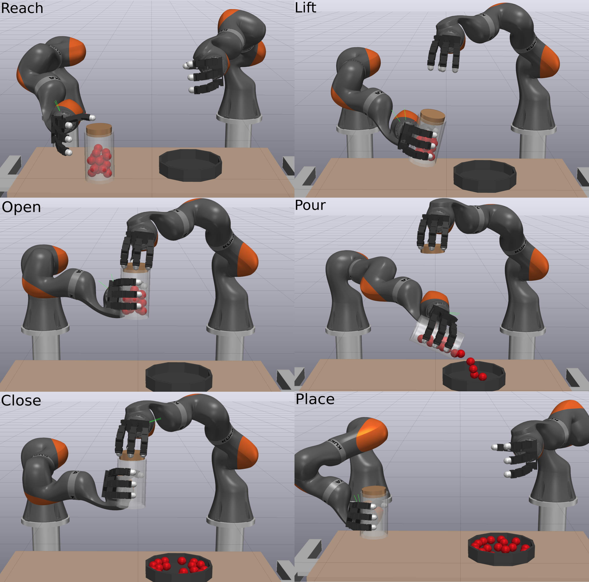

# 📄 Paper Repository: *An Unconstrained Convex Formulation of Compliant Contact*

**Citation**

> Castro, A.M., Permenter, F.N. and Han, X., 2022. *An unconstrained convex
> formulation of compliant contact.* IEEE Transactions on Robotics, 39(2),
> pp.1301-1320.

<p align="left">
  <a href="./sap_paper.pdf"></a>
  <a href="https://arxiv.org/abs/2110.10107"></a>
  <a href="https://www.youtube.com/watch?v=M_KI_cM1-rI"></a>
</p>

<p align="center">
  
</p>

<p align="center"><em>
Keyframes of a dual arm manipulation task in simulation (see supplemental video).  
The robot is commanded to pick up a jar full of marbles, open it, pour its contents into a bowl, close the lid and place the empty jar back in place.  
This is a computationally intensive simulation with 160 degrees of freedom and hundreds of contact constraints per time step.  
Our SAP solver is robust and warm-starts effectively, enabling this simulation to run at interactive rates.
</em></p>

---

## 📌 Overview

This repository contains the **LaTeX sources** of the published paper. The
implementation of the method itself is available in the open-source robotics
toolkit [Drake](https://drake.mit.edu).

---

## ✨ Abstract

> We present a convex formulation of compliant frictional contact and a robust,
> performant method to solve it in practice. By analytically eliminating contact
> constraints, we obtain an unconstrained convex problem. Our solver has proven
> global convergence and warm-starts effectively, enabling simulation at
> interactive rates. We develop compact analytical expressions of contact forces
> allowing us to describe our model in clear physical terms and to rigorously
> characterize our approximations. Moreover, this enables us not only to model
> point contact, but also to incorporate sophisticated models of compliant
> contact patches. Our time stepping scheme includes the midpoint rule, which we
> demonstrate achieves second order accuracy even with frictional contact. We
> introduce a number of accuracy metrics and show our method outperforms
> existing commercial and open source alternatives without sacrificing accuracy.
> Finally, we demonstrate robust simulation of robotic manipulation tasks at
> interactive rates, with accurately resolved stiction and contact transitions,
> as required for meaningful sim-to-real transfer. Our method is implemented in
> the open source robotics toolkit Drake.

---

## 📂 Repository Contents

* `main.tex` – Main LaTeX source
* `figures/` – All figures used in the paper
* `bibliography.bib` – References
* `sap_paper.pdf` – Compiled version of the paper

---

## 🛠️ How to Build

```bash
pdflatex main.tex
bibtex main
pdflatex main.tex
pdflatex main.tex
```

---

## 📬 Contact

If you use this work, please cite the paper. For questions, feel free to contact
the authors, reach out via GitHub issues or check out the
[Drake](https://github.com/RobotLocomotion/drake) project.
